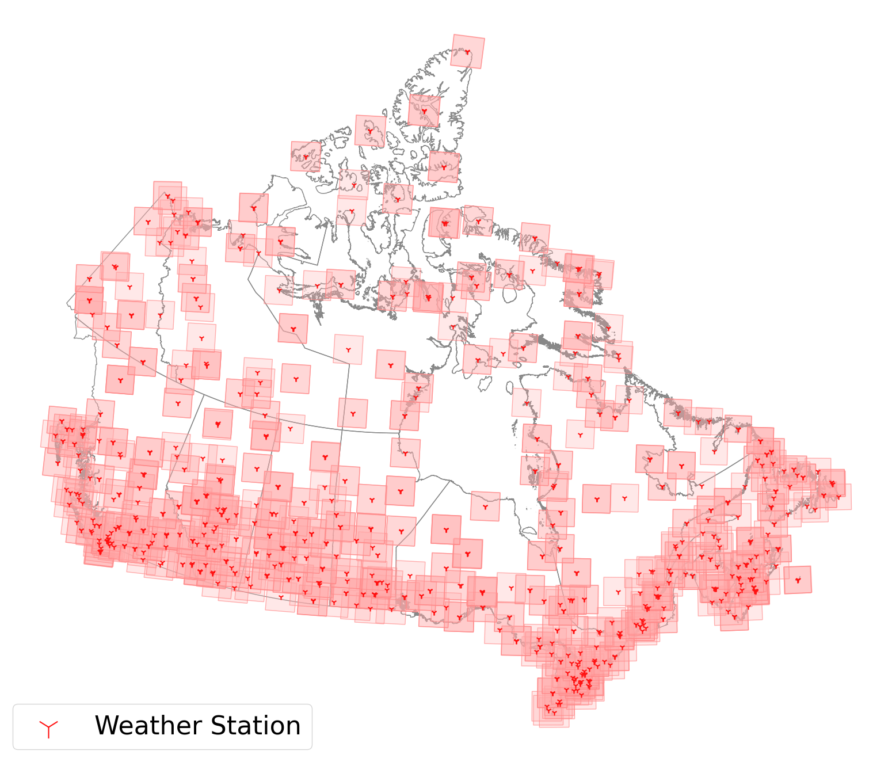

# NOAH: Now Observation Assemble Horizon

NOAH is a GenAI dataset that covers 8,742,469 km2 of non-overlapping land areas in Canada at 815 distinct locations under 5 modalities at 30 m spatial resolution, where each modality covers 40,000 km2

OpenReview Link: https://openreview.net/pdf?id=FCCVwnYD2N

This repository contains the following code:
  - Collation of NOAH and NOAH mini datasets
  - Code for data preprocessing
  - Code for data splitting
  - Code for data visualization
  - Code for data modelling with UNet + FiLM


## Table of Contents  
  - [Data](#data)
    - [Data Source](#data-sources)
    - [Data Sample](#data-sample)
    - [Data Repository](#data-repository)
  - [Model Architecture](#model-architecture)
  - [Code Initialization](#code-initialization)
  - [Citation](#citation)
  - [License](LICENSE)
  - [Acknowledgments](#acknowledgment)


## Data

The dataset covers 8,742,469 Km2 of non-overlapping land areas in Canada at 815 distinct locations.
Each sample covers 40,000 km2.
The spatial resolution is 30 m.
A figure showing the coverage is given below.


### Data Sources
|Name                   | Provider    | Link    |
|-----------------------|----------|---------|
| Topography            | SCANFI      | [Source](https://ftp.maps.canada.ca/pub/nrcan_rncan/Forests_Foret/SCANFI/v1/SCANFI_att_height_SW_2020_v1.2.tif)   |
| Land Cover of Canada  | NRCan       | [Source](https://open.canada.ca/data/en/dataset/11990a35-912e-4002-b197-d57dd88836d7)  |
| Biomass               | SCANFI      | [Source](https://ftp.maps.canada.ca/pub/nrcan_rncan/Forests_Foret/SCANFI/v1/SCANFI_att_biomass_SW_2020_v1.2.tif)   |
| Crown Cover           | SCANFI      | [Source](https://ftp.maps.canada.ca/pub/nrcan_rncan/Forests_Foret/SCANFI/v1/SCANFI_att_closure_SW_2020_v1.2.tif)   |
| Fuel Types            | NRCan       | [Source](https://open.canada.ca/data/dataset/4e66dd2f-5cd0-42fd-b82c-a430044b31de)  |
| Landsat 8             | NASA & USGS | [Source](https://developers.google.com/earth-engine/datasets/catalog/LANDSAT_LC08_C02_T1)  |
| Weather Station       | ECCC       | [Source](https://climate.weather.gc.ca/historical_data/search_historic_data_e.html)  |


### Data Sample
A sample of the data with diffrent modalities can be seen in the figure below.


### Data Repository 
A sample of the samaller verion of NOAH has been uploaded to Hugging Face.

> `Hugging Face` [NOAH mini](https://huggingface.co/datasets/mutakabbirCarleton/NOAH-mini)

## Model Architecture

To benchmark the results A UNet + FiLM apprach was used to account for the multi-modal dataset.
The architecure is given below.


## Code Initialization

Following are a list of dependancies need to execute the code with ease:
- Python 3.10.12
- Jupyter Notebooks
- Docker 
- Docker Compose

Ideally use the docker deployment to run the code as all the dependancies are preinstalled.

> The code is available as notebooks

### Docker Deployment

> - Ensure `port 8899` is open on your host machine. 
> - Ensure you have the [.env](.env) values configured according to your system requirements.

```
git clone https://github.com/Forest-Fire-Research/noah.git
cd noah
docker compose up -d
```

Open [Notebook - localhost:8899](localhost:8899) to run the code

### Local Code Execution

> You need to have running jupyter notebook environment and python installed

```
git clone https://github.com/Forest-Fire-Research/noah.git
cd noah
pip install -r requirements.txt
```

Once the requirements are installed you can run the code in notebooks

## Citation 
```
@inproceedings{
  noah2025neurips,
  title={NOAH: A Multi-Modal and Sensor Fusion Dataset for Generative Artificial Intelligence in Remote Sensing},
  author={!!! Truncated for review},
  booktitle={The Thirty-Ninth Annual Conference on Neural Information Processing Systems},
  year={2025},
  url={https://openreview.net/pdf?id=FCCVwnYD2N}
}
```

## Acknowledgments
> !!! Truncated for review
